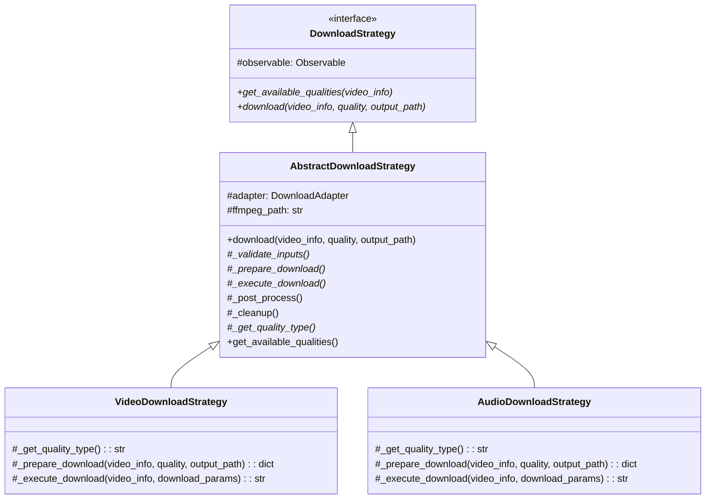
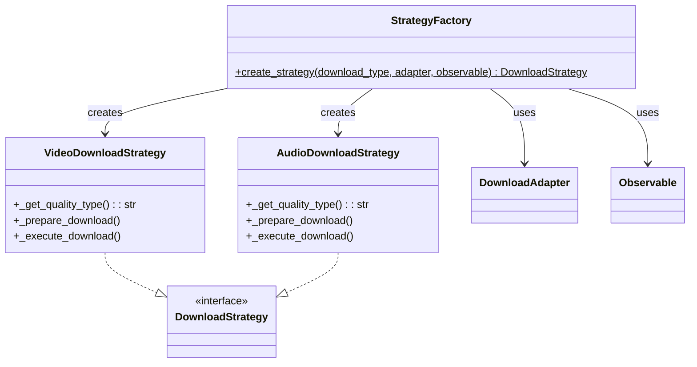
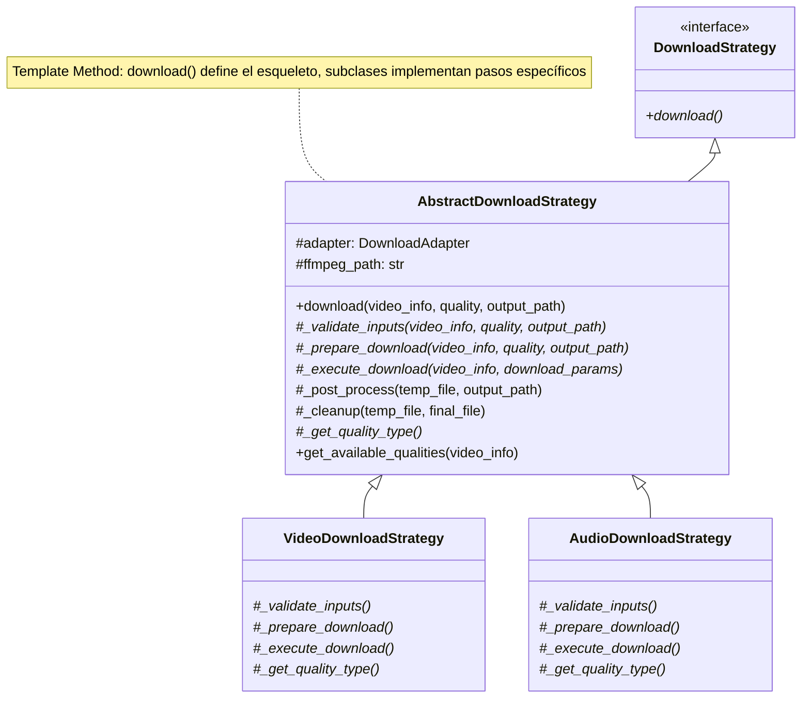
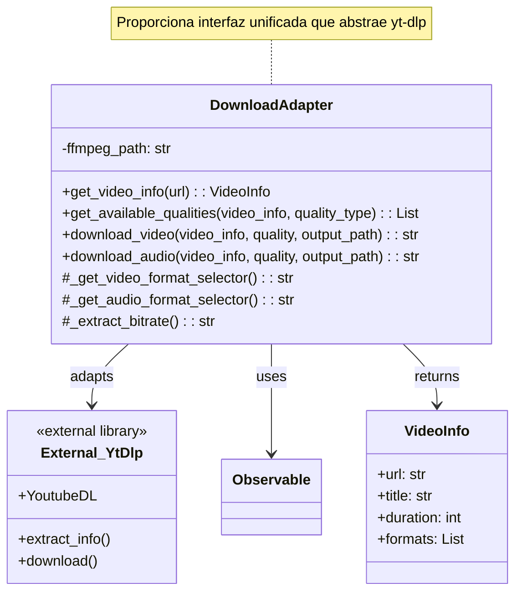
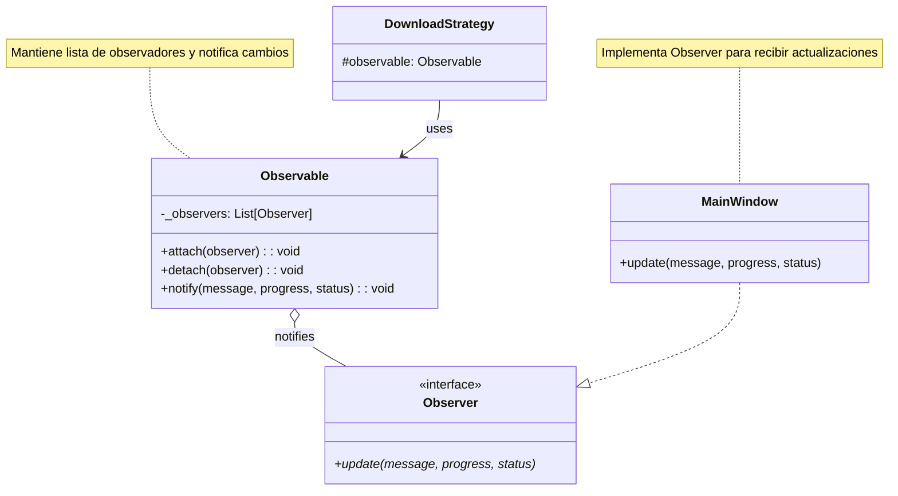
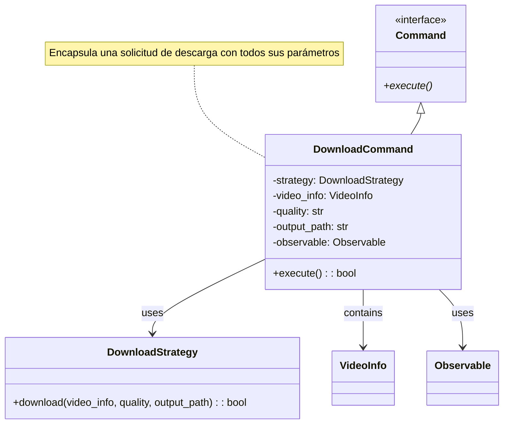
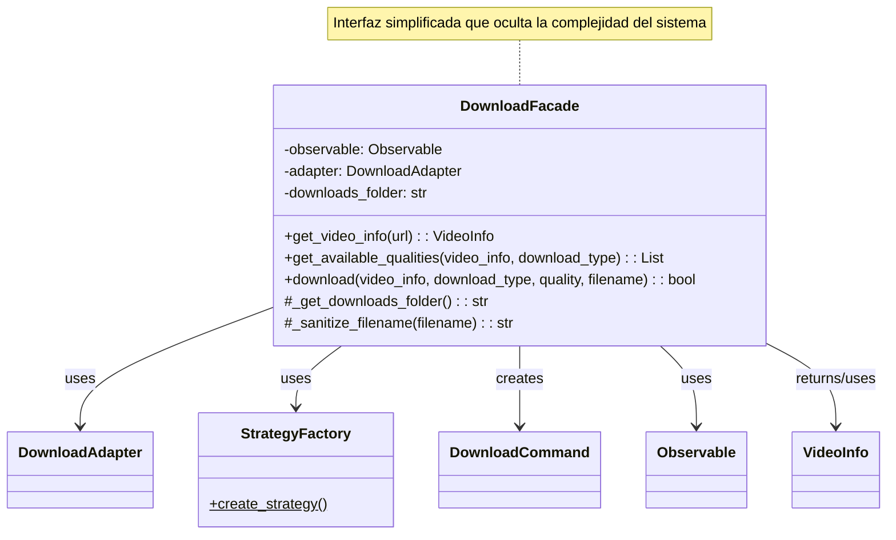

# ClipYTwo - Descargador de Videos de YouTube

ClipYTwo es una aplicación de escritorio desarrollada en Python que permite descargar videos y audio de YouTube con diferentes calidades. La aplicación está construida siguiendo el patrón arquitectónico Modelo-Vista-Controlador (MVC) e implementa múltiples patrones de diseño para garantizar un código mantenible, extensible y escalable.

## 📋 Tabla de Contenidos

- [Características](#características)
- [Requisitos](#requisitos)
- [Instalación](#instalación)
- [Uso](#uso)
- [Arquitectura](#arquitectura)
- [Patrones de Diseño](#patrones-de-diseño)
- [Compilación a Ejecutable](#compilación-a-ejecutable)
- [Estructura del Proyecto](#estructura-del-proyecto)
- [Tecnologías Utilizadas](#tecnologías-utilizadas)

## ✨ Características

- ✅ Descarga de videos de YouTube en múltiples calidades
- ✅ Descarga de audio en formato MP3
- ✅ Interfaz gráfica moderna con CustomTkinter
- ✅ Barra de progreso en tiempo real
- ✅ Selección de calidad antes de descargar
- ✅ Procesamiento de audio con FFmpeg
- ✅ Manejo robusto de errores
- ✅ Arquitectura MVC bien definida
- ✅ Implementación de múltiples patrones de diseño

## 📦 Requisitos

- Python 3.8 o superior
- pip (gestor de paquetes de Python)
- FFmpeg (incluido en `utils/ffmpeg.exe`)

## 🚀 Instalación

### 1. Clonar el Repositorio

```bash
git clone <url-del-repositorio>
cd ClipYTwo
```

### 2. Crear Entorno Virtual

Se recomienda encarecidamente usar un entorno virtual para evitar conflictos con otras dependencias:

**Windows:**
```bash
python -m venv venv
venv\Scripts\activate
```

**Linux/Mac:**
```bash
python3 -m venv venv
source venv/bin/activate
```

### 3. Instalar Dependencias

Con el entorno virtual activado, instala las dependencias:

```bash
pip install -r requirements.txt
```

Las dependencias incluyen:
- `yt-dlp`: Biblioteca para descargar videos de YouTube
- `customtkinter`: Interfaz gráfica moderna
- `pyinstaller`: Para compilar el ejecutable (opcional)

## 🎮 Uso

### Ejecutar la Aplicación

Con el entorno virtual activado:

```bash
python main.py
```

### Flujo de Uso

1. **Estado Inicial**: La aplicación muestra solo un campo de texto para ingresar la URL de YouTube y un botón con una flecha (→).

2. **Ingresar URL**: Copia y pega la URL del video de YouTube que deseas descargar.

3. **Procesar URL**: Haz clic en el botón "→" para obtener información del video.

4. **Seleccionar Opciones**: Una vez procesada la URL, aparecerán:
   - Listas desplegables para seleccionar la calidad (video y audio)
   - Botón "Descargar Video"
   - Botón "Descargar Audio"

5. **Descargar**: Selecciona la calidad deseada y haz clic en el botón correspondiente.

6. **Monitorear Progreso**: Observa la barra de progreso y los mensajes de estado.

7. **Finalización**: Una vez completada la descarga, la interfaz vuelve al estado inicial.

### Ubicación de Descargas

Las descargas se guardan en la carpeta `downloads/` dentro del directorio del proyecto.

## 🏗️ Arquitectura

El proyecto sigue el patrón arquitectónico **Modelo-Vista-Controlador (MVC)**:

### Modelo (`src/model/`)

Contiene las clases de datos que representan la información del sistema:

- **`VideoInfo`**: Almacena información del video (URL, título, duración, formatos disponibles)
- **`DownloadInfo`**: Representa el estado de una descarga (estado, progreso, mensajes)

### Vista (`src/view/`)

Maneja toda la interfaz gráfica de usuario:

- **`MainWindow`**: Ventana principal de la aplicación construida con CustomTkinter
  - Implementa el patrón Observer para recibir actualizaciones del modelo
  - Gestiona los diferentes estados de la interfaz (inicial, con opciones, descargando)

### Controlador (`src/controller/`)

Coordina la comunicación entre el modelo y la vista:

- **`MainController`**: Controlador principal
  - Procesa las acciones del usuario
  - Utiliza el Facade para simplificar operaciones complejas
  - Gestiona hilos para operaciones asíncronas

## 🎨 Patrones de Diseño

El proyecto implementa los siguientes patrones de diseño:

### 1. Strategy (Estrategia)

**Ubicación**: `src/patterns/strategy.py`, `src/patterns/factory.py`

Diferentes estrategias para descargar contenido según el tipo y calidad:

- `VideoDownloadStrategy`: Estrategia para descargar videos
- `AudioDownloadStrategy`: Estrategia para descargar audio

Cada estrategia implementa la interfaz `DownloadStrategy` y define su propia lógica de descarga.

#### Diagrama de Clases - Pattern Strategy



### 2. Factory (Fábrica)

**Ubicación**: `src/patterns/factory.py`

`StrategyFactory` crea la estrategia adecuada según el tipo de descarga solicitado:

```python
strategy = StrategyFactory.create_strategy('video', adapter, observable)
strategy = StrategyFactory.create_strategy('audio', adapter, observable)
```

#### Diagrama de Clases - Pattern Factory



### 3. Template Method (Método Plantilla)

**Ubicación**: `src/patterns/template_method.py`

`AbstractDownloadStrategy` define el esqueleto del algoritmo de descarga:

1. Validar entradas
2. Preparar descarga
3. Ejecutar descarga
4. Post-procesar (opcional)
5. Limpiar archivos temporales

Las subclases implementan los pasos específicos que varían (como `_prepare_download` y `_execute_download`).

#### Diagrama de Clases - Pattern Template Method



### 4. Adapter (Adaptador)

**Ubicación**: `src/patterns/adapter.py`

`DownloadAdapter` abstrae la API de `yt-dlp`, permitiendo que la aplicación sea independiente de la librería específica. Si en el futuro se desea cambiar a otra librería (como `pytube` o `youtube_dl`), solo se necesita adaptar esta clase.

**Beneficios**:
- Desacoplamiento de librerías externas
- Fácil cambio de implementación
- API unificada para el resto de la aplicación

#### Diagrama de Clases - Pattern Adapter



### 5. Observer (Observador)

**Ubicación**: `src/patterns/observer.py`

Sistema de notificaciones para actualizar la interfaz en tiempo real:

- `Observable`: Clase que notifica cambios de estado
- `Observer`: Interfaz implementada por `MainWindow` para recibir actualizaciones

**Uso**: Las estrategias de descarga notifican cambios (progreso, estado) que son observados por la vista para actualizar la UI.

#### Diagrama de Clases - Pattern Observer



### 6. Command (Comando)

**Ubicación**: `src/patterns/command.py`

`DownloadCommand` encapsula una solicitud de descarga como un objeto, permitiendo:

- Parametrizar operaciones
- Encolar operaciones (futuro)
- Deshacer operaciones (futuro)
- Registrar historial de operaciones

#### Diagrama de Clases - Pattern Command



### 7. Facade (Fachada)

**Ubicación**: `src/patterns/facade.py`

`DownloadFacade` proporciona una interfaz simplificada que oculta la complejidad del sistema:

```python
facade = DownloadFacade(observable)
video_info = facade.get_video_info(url)
qualities = facade.get_available_qualities(video_info, 'video')
success = facade.download(video_info, 'video', '720p')
```

**Beneficios**:
- Interfaz simple para operaciones complejas
- Oculta la complejidad de múltiples clases
- Facilita el uso del sistema

#### Diagrama de Clases - Pattern Facade



## 🔧 Compilación a Ejecutable

Para crear un ejecutable `.exe` de la aplicación:

### Opción 1: Usar el Script Batch (Recomendado)

```bash
build_exe.bat
```

Este script:
1. Instala las dependencias si es necesario
2. Limpia compilaciones anteriores
3. Compila el ejecutable usando PyInstaller

### Opción 2: Compilación Manual

1. **Activar el entorno virtual** (importante para incluir las dependencias correctas):

```bash
venv\Scripts\activate
```

2. **Instalar PyInstaller** (si no está instalado):

```bash
pip install pyinstaller
```

3. **Compilar el ejecutable**:

```bash
pyinstaller --clean ClipYTwo.spec
```

### Resultado

El ejecutable se generará en la carpeta `dist/ClipYTwo.exe`

**Notas importantes**:
- El ejecutable incluye automáticamente:
  - El icono (`public/icon/icon.ico`)
  - FFmpeg (`utils/ffmpeg.exe`)
  - Todas las dependencias necesarias
- El tamaño del ejecutable puede ser grande (50-100 MB) debido a las dependencias incluidas
- El ejecutable es independiente y no requiere Python instalado en el sistema

### Configuración de PyInstaller

El archivo `ClipYTwo.spec` contiene la configuración:

- **console=False**: No muestra ventana de consola
- **icon**: Especifica el icono del ejecutable
- **datas**: Archivos adicionales a incluir (icono, ffmpeg)

## 📁 Estructura del Proyecto

```
ClipYTwo/
│
├── src/                          # Código fuente principal
│   ├── model/                    # Modelos de datos (MVC)
│   │   ├── __init__.py
│   │   ├── video_info.py         # Información del video
│   │   └── download_info.py      # Estado de descarga
│   │
│   ├── view/                     # Vistas (MVC)
│   │   ├── __init__.py
│   │   └── main_window.py        # Ventana principal
│   │
│   ├── controller/               # Controladores (MVC)
│   │   ├── __init__.py
│   │   └── main_controller.py    # Controlador principal
│   │
│   ├── patterns/                 # Patrones de diseño
│   │   ├── __init__.py
│   │   ├── observer.py           # Patrón Observer
│   │   ├── strategy.py           # Patrón Strategy
│   │   ├── factory.py            # Patrón Factory
│   │   ├── template_method.py    # Patrón Template Method
│   │   ├── adapter.py            # Patrón Adapter
│   │   ├── command.py            # Patrón Command
│   │   └── facade.py             # Patrón Facade
│   │
│   └── __init__.py
│
├── public/                       # Recursos públicos
│   └── icon/
│       └── icon.ico              # Icono de la aplicación
│
├── utils/                        # Utilidades
│   └── ffmpeg.exe               # Ejecutable FFmpeg
│
├── downloads/                    # Carpeta de descargas (se crea automáticamente)
│
├── main.py                       # Punto de entrada de la aplicación
├── requirements.txt              # Dependencias del proyecto
├── ClipYTwo.spec                # Configuración de PyInstaller
├── build_exe.bat                # Script para compilar ejecutable
└── README.md                     # Este archivo
```

## 🛠️ Tecnologías Utilizadas

- **Python 3.8+**: Lenguaje de programación
- **yt-dlp**: Biblioteca para descargar videos de YouTube
- **CustomTkinter**: Framework de interfaz gráfica moderna
- **FFmpeg**: Procesamiento de audio/video
- **PyInstaller**: Compilación a ejecutable

## 📝 Notas Adicionales

### Entorno Virtual

**¿Por qué usar un entorno virtual?**

- Evita conflictos entre versiones de paquetes de diferentes proyectos
- Permite mantener un entorno limpio y reproducible
- Facilita el despliegue en diferentes máquinas
- Es una práctica recomendada en desarrollo Python

**Comandos útiles:**

```bash
# Activar entorno virtual
venv\Scripts\activate      # Windows
source venv/bin/activate   # Linux/Mac

# Desactivar entorno virtual
deactivate

# Ver paquetes instalados
pip list

# Exportar dependencias (ya incluido en requirements.txt)
pip freeze > requirements.txt
```

### Solución de Problemas

**Error: "No module named 'customtkinter'"**
- Asegúrate de tener el entorno virtual activado
- Ejecuta: `pip install -r requirements.txt`

**Error: "FFmpeg not found"**
- Verifica que `utils/ffmpeg.exe` existe
- Si estás usando el .exe compilado, asegúrate de que ffmpeg está incluido en la compilación

**El ejecutable no funciona**
- Verifica que todas las dependencias están instaladas en el entorno virtual antes de compilar
- Prueba compilar con: `pyinstaller --clean --onefile ClipYTwo.spec`

**Descarga lenta**
- Depende de la conexión a internet y del servidor de YouTube
- Algunos videos pueden tener restricciones de descarga

## 📄 Licencia

[Especificar licencia si aplica]

## 👥 Contribuciones

Las contribuciones son bienvenidas. Por favor:

1. Haz un fork del proyecto
2. Crea una rama para tu feature (`git checkout -b feature/AmazingFeature`)
3. Commit tus cambios (`git commit -m 'Add some AmazingFeature'`)
4. Push a la rama (`git push origin feature/AmazingFeature`)
5. Abre un Pull Request

## 📧 Contacto

[Información de contacto si aplica]

---

**Desarrollado con ❤️ usando Python y patrones de diseño**

